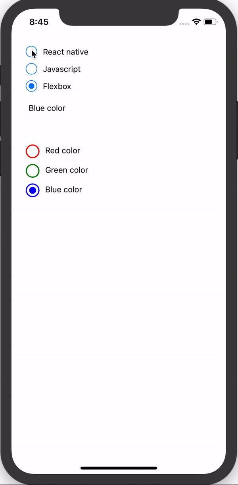

# react-native-custom-radio-button
Simple and animated radio button component for React Native


Demo
---




## Installation

```sh
npm i react-native-custom-radio-button --save
```

# Getting started

Basic
---

```js
import {RadioGroup, RadioButton} from 'react-native-custom-radio-button'

onSelect(index, value){
  this.setState({
    text: `${value}`
  })
}

render(){
  return(
    <View style={styles.container}>
    
      <RadioGroup
        onSelect = {(index, value) => this.onSelect(index, value)}
      >
        <RadioButton value={'React native'}>
          <Text style={styles.title}>React native</Text>
        </RadioButton>

        <RadioButton value={'Javascript'}>
          <Text style={styles.title}>Javascript</Text>
        </RadioButton>

        <RadioButton value={'Flexbox'}>
          <Text style={styles.title}>Flexbox</Text>
        </RadioButton>
      </RadioGroup>
      
      <Text style={styles.text}>{this.state.text}</Text>
      
    </View>
  )
}
```

Custom
---
```js
   <RadioGroup
      size={24}
      thickness={2}
      selectedIndex={1}
      onSelect = {(index, value) => this.onSelect(index, value)}
    >
      <RadioButton 
        value='Red color'
        color='red'>
        <Text style={styles.title}>Red color</Text>
      </RadioButton>

      <RadioButton 
        value='Green color'
        color='green'>
        <Text style={styles.title}>Green color</Text>
      </RadioButton>

      <RadioButton 
        value='Blue color'
        color='blue'>
        <Text style={styles.title}>Blue color</Text>
      </RadioButton>
    </RadioGroup>
```
### Configuration
##### Radio Group:
| Property | Type | Default | Description |
|---------------|----------|-------------|----------------------------------------------------------------|
| size | number | 20 | radio button size |
| thickness | number | 1 | radio button border width |
| color | string | '#007AFF' | radio button color |
| highlightColor | string | null | selected radio button background |
| selectedIndex | number | null | default selected index of radio group |
| onSelect | function(index, value) | null | function to be invoked when radio button is selected |

# Contributing
Of course! Welcome :)

You can use following command in `example` dir:
